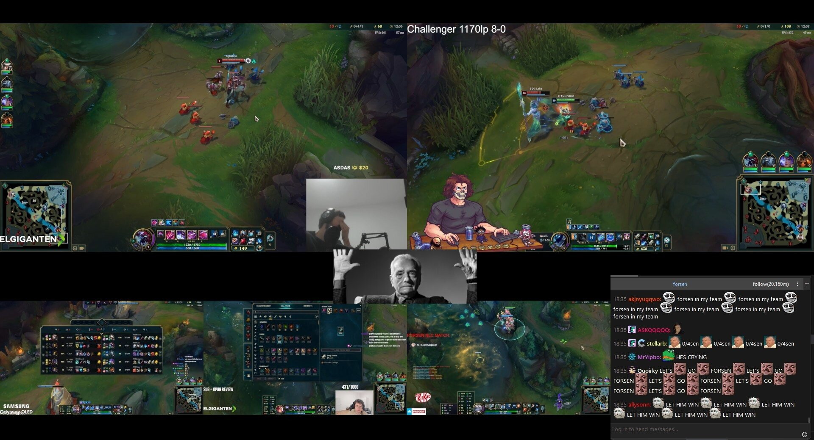

# Cinema

## Download

You can download the latest installable version of Cinema for Windows [here (GitHub releases page)](https://github.com/marm00/cinema/releases).

## Overview

Cinema gives you a video wall with full control over the layout and content, powered by [mpv](https://github.com/mpv-player/mpv/). Pressing enter shuffles the content, type *help* for more information.

Customize your settings in [cinema.conf](./cinema.conf) or by typing commands from the [list of commands](#list-of-commands), which can also be used for things like search, autoplay, and macros.

## Features

* Video wall (multiple screens) of mpv-supported media, including Twitch streams.
* Instant search across your media library, as well as tags to group media.
* Shuffle on demand or autoplay.
* Save and load layouts of screens and Chatterino.
* Macros to do many things at once, optionally on startup.
* And a lot more: [list of commands](#list-of-commands).

## Bugs and requests

Please use the [issue tracker](https://github.com/marm00/cinema/issues) here on GitHub to submit a bug report or request a feature.

## Compilation

Windows only for now. Make sure you have [Build Tools for Visual Studio](https://visualstudio.microsoft.com/downloads/#build-tools-for-visual-studio-2026) and [LLVM](https://github.com/llvm/llvm-project/releases). The [RAD Debugger](https://github.com/EpicGamesExt/raddebugger) is recommended for development.

Run `build.bat`. It builds in debug mode with openmp enabled by default. For the release version, run `build release`. To disable openmp, run `build nomp`. Run `build log_[X]` where [X] is one of *trace*, *debug* (default for debug builds), *info*, *warning* (default for release builds), *error*. You will get cinema.exe, which accepts no arguments.

## Contributing

Please read [CONTRIBUTING.md](./CONTRIBUTING.md). Pull requests are always welcome.

## License

MIT

## List of commands

Commands have autocomplete and optional arguments. For example: `2 4 s foo` sets the playlist of screen 2 and 4 to media containing the search term foo, whereas just `s foo` sets it for all screens. Below is a list of all commands in alphabetical order (you can get a sufficient summary of this list with the *help* command in Cinema):

`autoplay` Autoplay media [(1 2 ..) autoplay (*seconds*)]. If *seconds* (number) is omitted, the next playlist entry will always play after the current one ends. If *seconds* is greater than 0, the next one plays every [value of *seconds*] seconds. Setting *seconds* to 0 turns off autoplay.

`chat` Show or reposition chat ([Chatterino](https://chatterino.com/)). You can move the window and use the *store* command to save the updated location and size.

`clear` Clear the current tag or search term [(1 2 ..) clear]. This restores the default playlist.

`copy` Copy url(s) to clipboard [(1 2 ..) copy]. The clipboard contents are formatted in support of [Everything](https://www.voidtools.com/faq/#searching), meaning you can paste directly into Everything and the exact files will show up.

`extra` Adds an extra screen to the current layout. You can use the *store* command to update the layout beyond this session.

`help` Show all commands.

`hide` Hide media with term [hide term]. The results of future searches will not include any files containing the provided term (you can use this to exclude specific file extensions, for example). Note that this is separate from *tags*, those playlists are not impacted by the *hide* command.

`kill` Kill screen(s) and chat [(1 2 ..) kill]. Closes the mpv instances and Chatterino instance, without exiting (use the *quit* command to kill everything and exit).

`layout` Change layout to name [layout (*name*)]. Layouts are stored in cinema.conf and contain a name, one or more screens, and optionally Chatterino size and position. See cinema.conf for more information. You can use the *store* command to save an updated layout to this file, or do it manually.

`list` Show all tags. These tags come from your cinema.conf file and can be supplied as an argument to the *tag* command.

`lock` Lock/unlock screen contents [(1 2 ..) lock]. Whenever the current playlist entry would change, it does not do so when locked. I.e., autoplay stops, the entry loops indefinitely, and the *reroll* command does nothing. This is a toggle.

`macro` Execute macro [macro (*name*)]. Macros are collections of predefined commands (with arguments) stored in cinema.conf that execute in the exact same way as typing them out manually. You can for example have a macro that changes the layout, adjusts the search term, and enables autoplay, and execute it all with just this one command.

`maximize` Maximize and close others [(1) maximize]. Example: with three active screens, screen 1 is directed to be maximized, and will be set to full screen, while screens 2 and 3 are closed (see the *kill* command).

`mute` Mute/unmute screen(s) [(1 2 ..) mute]. This is a toggle.

`quit` Close screens and quit Cinema. See the *kill* command to close specific screens, chat, and keep Cinema alive.

`reroll` Shuffle media [(1 2 ..) (*reroll*)]. This is the default autocomplete command. Each screen is associated with a playlist. When autoplay is enabled, or if this command is executed, the next entry in the playlist is loaded. Cinema uses the standard Fisher–Yates algorithm with a partial Sattolo shuffle.

`search` Limit media to term [(1 2 ..) search (*term*)]. The playlists will be updated to only have media that includes the *term*. For example, searching for *C:*, *foo*, or *.mp4* will ensure that the playlist only contains files with *C:*, *foo*, or *.mp4* in their names. Cinema uses [libsais](https://github.com/IlyaGrebnov/libsais) to construct a generalized suffix array (GSA) and longest common prefix (LCP) array on launch and queries it (with result deduplication) on demand.

`store` Store layout in cinema.conf [store (*layout*)]. You can store the current state, which includes all screens, their sizes and positions, as well as chat, to a new or existing layout by *name*. This is an alternative to modifying cinema.conf manually.

`swap` Swap screen contents [(1 2) swap]. Makes screen 1 play the media of screen 2 and vice versa.

`tag` Limit media to tag [(1 2 ..) tag (*name*)]. The tags defined in cinema.conf can be used to map one or more names to a collection of media. This command allows you to load those playlists.

`twitch` Show channel [(1 2 ..) twitch (*channel*)]. This command can be used to show a twitch channel without having to modify cinema.conf (and thus restart Cinema). You only have to supply the *channel* name.
