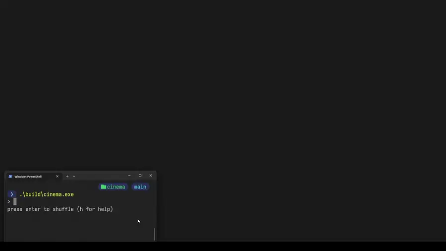

# Cinema

## Download

You can download the latest installable version of Cinema for Windows/Linux [here (GitHub releases page)](https://github.com/marm00/cinema/releases).

## Overview

Watch many streams or videos at once from the command line (with chat). Pressing enter shuffles the content, type *help* for more information.

Settings for layouts and media are stored in your [cinema.conf](./cinema.conf) file. Type commands from the [list of commands](#list-of-commands) for things like search, autoplay, and macros.

Making your terminal always on top or changing mpv.conf [*ontop*](https://mpv.io/manual/stable/#options-ontop) settings is recommended so that mpv never takes focus.

## Features

* Multiviewer for [mpv](https://github.com/mpv-player/mpv/)-supported media, including Twitch streams.
* Instant search across your files, and tags to group media.
* Save and load layouts (including [Chatterino](https://chatterino.com/)).
* Macros to do many things at once, optionally on startup.

## Bugs and requests

Please use the [issue tracker](https://github.com/marm00/cinema/issues) here on GitHub to submit a bug report or request a feature.

## Compilation

**Windows:** Make sure you have [Build Tools for Visual Studio](https://visualstudio.microsoft.com/downloads/#build-tools-for-visual-studio-2026) (select 'Desktop development with C++' when prompted) and [LLVM](https://github.com/llvm/llvm-project/releases/latest) (recommend 'add to PATH' option). The [RAD Debugger](https://github.com/EpicGamesExt/raddebugger) is recommended for development.

Run `build.bat` (Windows) or `build.sh` (Linux). It builds in debug mode with openmp enabled by default. For the release version, run `build release`. To disable openmp, run `build nomp`. To enable address sanitizer, run `build asan`. Specify the log level with `build log_[X]` where [X] is one of *trace*, *debug* (default for debug builds), *info*, *warning* (default for release builds), *error*, descending in frequency. You will get an exectuable that accepts no arguments.

MacOS has not been tested, most code (posix-compliant) should work.

## Contributing

Please read [CONTRIBUTING.md](./CONTRIBUTING.md). Pull requests are always welcome.

## License

MIT

## List of commands

Commands are formatted like: `[(screen(s)) command (argument(s))]`  
Example 1: `2 4 search foo` plays file names containing foo on screens 2 and 4.  
Example 2: `autoplay` enables autoplay for all screens.

### Main commands

**`layout`** Change layout to name [layout (*name*)]. Sets up screens and chat.

**`store`** Store layout in cinema.conf [store (*layout name*)]. Creates or updates the layout in cinema.conf.

**`twitch`** Show channel [(1 2 ..) twitch (*channel*)]. Shortcut to watch a specific stream.

**`search`** Limit media to term [(1 2 ..) search (*term*)]. Searches through all directories and urls in cinema.conf. Example searches: *C:*, *foo*, *.mp4*, */bar/baz/*.

**`tag`** Limit media to tag [(1 2 ..) tag (*name*)]. Tags group media, stored in cinema.conf.

### Other commands

**`autoplay`** Autoplay media [(1 2 ..) autoplay (*seconds*)]. *Seconds* can be 0 (turn off autoplay), greater than 0 (shuffle every *seconds* seconds), or not provided (shuffles when video ends or image was shown for 5 seconds).

**`chat`** Show or reposition chat. You can move the window and use the *store* command to save the updated location and size.

**`clear`** Clear the current tag or search term [(1 2 ..) clear]. This restores the default playlist.

**`copy`** Copy url(s) to clipboard [(1 2 ..) copy]. The clipboard contents are formatted in support of [Everything](https://www.voidtools.com/faq/#searching). Does not copy on posix, only print.

**`extra`** Adds an extra screen to the current layout. You can use the *store* command to update the layout beyond this session.

**`help`** Show all commands.

**`hide`** Hide media with term [hide term]. Future *search* commands will not return hidden files. This can be used to exclude specific file extensions, for example.

**`idle`** Make commands (not) play media [idle]. Toggle whether a command is allowed to play media (*idle tag art idle* would update the tag but not play a new file).

**`kill`** Kill screen(s) and chat [(1 2 ..) kill]. Closes the windows and Chatterino, without exiting Cinema (use the *quit* command to kill everything and exit).

**`list`** Show all tags.

**`lock`** Lock/unlock screen contents [(1 2 ..) lock]. Toggle whether a screen is allowed to play new files. Would ignore things like *autoplay*, *shuffle*, *tag* if enabled.

**`macro`** Execute macro [macro (*name*)]. Processes a macro command by command. Macros are stored in cinema.conf.

**`maximize`** Maximize and close others [(1) maximize]. Kills all windows except (1) and sets it to fullscreen.

**`mute`** Mute/unmute screen(s) [(1 2 ..) mute]. This is a toggle.

**`quit`** Close windows and quit Cinema.

**`shuffle`** Shuffle media [(1 2 ..) (*shuffle*)]. Plays a new file. This is the default autocomplete command.

**`swap`** Swap screen contents [(1 2) swap]. Makes screen 1 play the media of screen 2 and vice versa.

